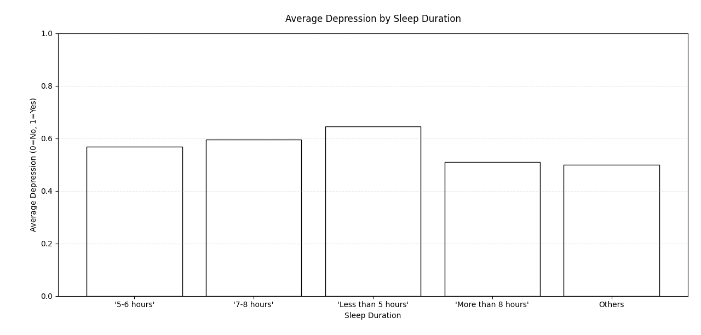

# Data Visualization Student Depression DataSet

## Example Data

| id  | Gender | Age  | City         | Profession | Academic Pressure | Work Pressure | CGPA | Study Satisfaction | Job Satisfaction | Sleep Duration     | Dietary Habits | Degree     | Have you ever had suicidal thoughts ? | Work/Study Hours | Financial Stress | Family History of Mental Illness | Depression |
|-----|--------|------|--------------|------------|-------------------|----------------|------|---------------------|-------------------|---------------------|----------------|------------|--------------------------------------|------------------|------------------|-------------------------------|------------|
| 2   | Male   | 33.0 | Visakhapatnam | Student    | 5.0               | 0.0            | 8.97 | 2.0                 | 0.0               | 5-6 hours           | Healthy        | B.Pharm    | Yes                                  | 3.0              | 1.0              | No                            | 1          |
| 8   | Female | 24.0 | Bangalore     | Student    | 2.0               | 0.0            | 5.9  | 5.0                 | 0.0               | 5-6 hours           | Moderate       | BSc        | No                                   | 3.0              | 2.0              | Yes                           | 0          |
| 26  | Male   | 31.0 | Srinagar      | Student    | 3.0               | 0.0            | 7.03 | 5.0                 | 0.0               | Less than 5 hours   | Healthy        | BA         | No                                   | 9.0              | 1.0              | Yes                           | 0          |
| 30  | Female | 28.0 | Varanasi      | Student    | 3.0               | 0.0            | 5.59 | 2.0                 | 0.0               | 7-8 hours           | Moderate       | BCA        | Yes                                  | 4.0              | 5.0              | Yes                           | 1          |
| 32  | Female | 25.0 | Jaipur        | Student    | 4.0               | 0.0            | 8.13 | 3.0                 | 0.0               | 5-6 hours           | Moderate       | M.Tech     | Yes                                  | 1.0              | 1.0              | No                            | 0          |
| 33  | Male   | 29.0 | Pune          | Student    | 2.0               | 0.0            | 5.7  | 3.0                 | 0.0               | Less than 5 hours   | Healthy        | PhD        | No                                   | 4.0              | 1.0              | No                            | 0          |
| 52  | Male   | 30.0 | Thane         | Student    | 3.0               | 0.0            | 9.54 | 4.0                 | 0.0               | 7-8 hours           | Healthy        | BSc        | No                                   | 1.0              | 2.0              | No                            | 0          |
| 56  | Female | 30.0 | Chennai       | Student    | 2.0               | 0.0            | 8.04 | 4.0                 | 0.0               | Less than 5 hours   | Unhealthy      | Class 12   | No                                   | 0.0              | 1.0              | Yes                           | 0          |
| 59  | Male   | 28.0 | Nagpur        | Student    | 3.0               | 0.0            | 9.79 | 1.0                 | 0.0               | 7-8 hours           | Moderate       | B.Ed       | Yes                                  | 12.0             | 3.0              | No                            | 1          |
| 62  | Male   | 31.0 | Nashik        | Student    | 2.0               | 0.0            | 8.38 | 3.0                 | 0.0               | Less than 5 hours   | Moderate       | LLB        | Yes                                  | 2.0              | 5.0              | No                            | 1          |
| 83  | Male   | 24.0 | Nagpur        | Student    | 3.0               | 0.0            | 6.1  | 3.0                 | 0.0               | 5-6 hours           | Moderate       | Class 12   | Yes                                  | 11.0             | 1.0              | Yes                           | 1          |
| 91  | Male   | 33.0 | Vadodara      | Student    | 3.0               | 0.0            | 7.03 | 4.0                 | 0.0               | Less than 5 hours   | Healthy        | BE         | Yes                                  | 10.0             | 2.0              | Yes                           | 0          |
| 94  | Male   | 27.0 | Kalyan        | Student    | 5.0               | 0.0            | 7.04 | 1.0                 | 0.0               | Less than 5 hours   | Moderate       | M.Tech     | No                                   | 10.0             | 1.0              | Yes                           | 1          |
| 100 | Female | 19.0 | Rajkot        | Student    | 2.0               | 0.0            | 8.52 | 4.0                 | 0.0               | Less than 5 hours   | Unhealthy      | Class 12   | No                                   | 6.0              | 2.0              | Yes                           | 0          |
| 103 | Female | 19.0 | Kalyan        | Student    | 5.0               | 0.0            | 5.64 | 5.0                 | 0.0               | Less than 5 hours   | Moderate       | Class 12   | Yes                                  | 4.0              | 5.0              | Yes                           | 1          |

# Data Visualization

